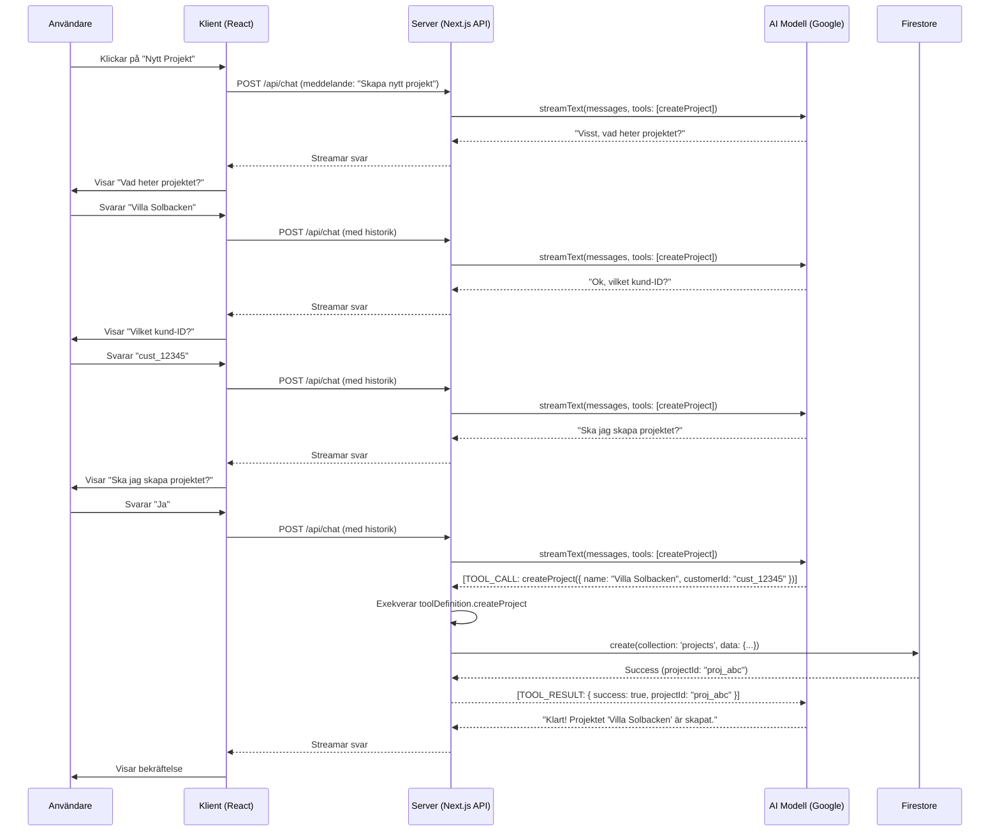

# ByggPilot: Användarflöden & Datamodeller

Detta dokument är en del av vår Guldstandard och agerar som Sanningens Enda Källa för systemets flöden och datastrukturer.

## 1. Användarflöde: Skapa ett Nytt Projekt via Co-Pilot

## 2. Datamodell: `Project`

- **Collection:** `projects`
- **Dokument-ID:** Automatiskt genererat av Firestore

| Fält | Datatyp | Obligatoriskt? | Beskrivning |
| :--- | :--- | :--- | :--- |
| `name` | `string` | Ja | Projektets namn, t.ex. "Renovering Kök". |
| `customerId` | `string` | Ja | Referens (ID) till ett dokument i `customers`-collection. |
| `status` | `string` | Ja | Projektets nuvarande status. Tillåtna värden: `pending`, `active`, `completed`, `on-hold`, `cancelled`. Standard: `pending`. |
| `budget` | `number` | Nej | Projektets totala budget i kronor. |
| `timeline` | `string` | Nej | En textbeskrivning av tidslinjen, t.ex. "Q3 2024 - Q1 2025". |
| `createdAt`| `Timestamp`| Ja | Tidsstämpel när dokumentet skapades. |
| `updatedAt`| `Timestamp`| Ja | Tidsstämpel när dokumentet senast uppdaterades. |

